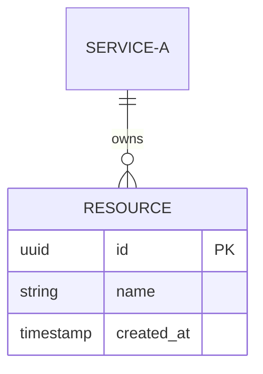

# Spec Template

Reference template for `system-designer` agent output. OpenAPI 3.1 YAML is the primary contract — language-specific types are derived examples.

---

## Structure

```markdown
# [Feature Name]

## Context
[1-3 sentences: what problem this solves, who requested it, what triggered the design]

## Service Boundaries
| Service | Owns | Depends On |
|---------|------|------------|
| [service-a] | [entities, behaviors] | [external services] |
| [service-b] | [entities, behaviors] | [service-a] |

## API Contract

### [POST /resource]
```yaml
# OpenAPI 3.1
paths:
  /resource:
    post:
      summary: Create a resource
      requestBody:
        required: true
        content:
          application/json:
            schema:
              $ref: '#/components/schemas/CreateResourceRequest'
      responses:
        '201':
          description: Resource created
          content:
            application/json:
              schema:
                $ref: '#/components/schemas/ResourceResponse'
        '400':
          description: Validation error
        '401':
          description: Unauthorized
```

### Components
```yaml
components:
  schemas:
    CreateResourceRequest:
      type: object
      required: [name]
      properties:
        name:
          type: string
          description: Human-readable resource name
    ResourceResponse:
      type: object
      properties:
        id:
          type: string
          format: uuid
        name:
          type: string
        createdAt:
          type: string
          format: date-time
```

## Language-Specific Types (derived from OpenAPI)

> Optional. Include when the consuming project's stack is known.
> Label clearly as derived — the OpenAPI spec above is the source of truth.

### TypeScript (if applicable)
```typescript
// Derived from OpenAPI — see API Contract above for source of truth
interface CreateResourceRequest {
  name: string;
}

interface ResourceResponse {
  id: string;
  name: string;
  createdAt: string; // ISO 8601
}
```

### Go (if applicable)
```go
// Derived from OpenAPI — see API Contract above for source of truth
type CreateResourceRequest struct {
    Name string `json:"name" validate:"required"`
}

type ResourceResponse struct {
    ID        string `json:"id"`
    Name      string `json:"name"`
    CreatedAt string `json:"createdAt"`
}
```

### Python (if applicable)
```python
# Derived from OpenAPI — see API Contract above for source of truth
@dataclass
class CreateResourceRequest:
    name: str

@dataclass
class ResourceResponse:
    id: str
    name: str
    created_at: str  # ISO 8601
```

## Data Models


## Error Contract
| Code | HTTP Status | When |
|------|-------------|------|
| RESOURCE_NOT_FOUND | 404 | Resource ID does not exist |
| VALIDATION_ERROR | 400 | Request body fails schema validation |

## Events (if applicable)
| Event | Producer | Consumer(s) | Payload | Idempotent |
|-------|----------|-------------|---------|------------|
| resource.created | service-a | service-b | `{ id, name, createdAt }` | Yes (by id) |

## Auth Requirements
[What auth is required, which roles/scopes can access each endpoint]

## Implementation Handoff
1. **backend-developer**: Implement endpoints per OpenAPI contract in `<repo>/`
2. **[frontend agent]**: Build UI consuming the type examples (or derive from OpenAPI)
3. **devops-engineer**: [If infrastructure changes needed]
```
