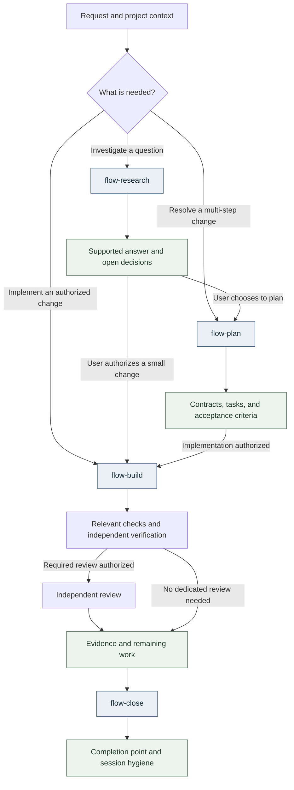

<div align="center">

<h1>Hive</h1>

<p><strong>Portable guidance for deliberate work with coding agents.</strong></p>
<p>Clarify the request. Preserve the project. Verify the result.</p>

<p>
<a href="#get-started">Get started</a> ·
<a href="#a-workflow-with-room-for-judgment">Workflow</a> ·
<a href="#cli-targets">CLI targets</a> ·
<a href="#documentation">Documentation</a>
</p>

</div>

Hive brings shared working practices to **Claude Code, Codex, Grok Build, Pi,
OpenCode V2, and Cursor CLI**. It supplies guidance, activity skills, specialist
role definitions, and a manager that installs them in the host's native locations.
Each CLI keeps its own model loop, authentication, tools, permissions, and history.

Use it to investigate an uncertain request, plan a consequential change, or carry
an understood task through implementation and verification—with clear boundaries
between what was requested, what was authorized, and what was demonstrated.

> **Development preview · 0.0.2**
> The project is in a rebuild phase. [VERSION](VERSION) is the canonical product
> version; this version is being prepared locally. Packages can be built from
> source, but no published release or online distribution origin is advertised here.

## Why Hive

- **Start at the right depth.** A question can end with an answer. A small,
  understood change can go straight to implementation. Larger work gets explicit
  contracts, decisions, and acceptance criteria.
- **Make handoffs useful.** Specialist roles receive a bounded task, owned paths,
  relevant context, and evidence to return. Implementation, review, and
  verification have separate responsibilities.
- **Keep decisions connected to evidence.** Requirements and change records
  preserve context; findings distinguish observed results from assumptions and
  unfinished work.
- **Manage guidance without replacing the host.** Installation previews affected
  destinations, checks ownership and drift, preserves user content outside managed
  resources, and supports diagnosis and recovery.

## Get started

Install your coding CLI separately, then choose a Hive installation route. Hive
neither installs CLI executables nor authenticates providers. Close affected CLI
sessions before applying changes and start new sessions afterward.

### From a source checkout

From the checkout root, with **Go 1.27.0 or later** as declared in [go.mod](go.mod):

```sh
# Preview the destinations, then install with terminal confirmation.
go run ./tooling/cli install --hosts codex --dry-run
go run ./tooling/cli install --hosts codex
```

Replace `codex` with your host, or a comma-separated selection such as
`codex,claude`. The installer shows destinations and private backup locations
before requiring affirmative confirmation. The first build needs access to the
Go modules unless they are already cached.

### From a complete package

Extract a complete package for **macOS Apple Silicon** or **Linux ARM64/AMD64**,
then run:

```sh
./install.sh --dry-run
./install.sh
```

Offline installation needs no Go, Git, GitHub CLI, network download, or terminal
authentication. A complete package includes the executable, content, and
verification inventory; GitHub's automatic **Source code** archives do not.
macOS Intel is unsupported. Platform build support and native installation
verification are separate checks.

<details>
<summary><strong>Package building and optional capabilities</strong></summary>

Maintainers can build packages locally with `go run ./tooling/package --out ./dist`.
Building does not publish a release. `bootstrap.sh` still contains an origin
placeholder and is unsuitable for online installation until an HTTPS origin is
published and configured.

Engram, Context7, and pi-subagents are optional, separately managed capabilities.
This version provides official manual instructions, with no automated provider
recipes or credential requests. Selecting a manual capability leaves the installed
core intact but returns a non-zero exit status to signal unfinished setup.
`go run ./tooling/cli setup` reports local discovery without installing tools;
discovery does not establish authentication, service access, or host loading.

See the [installer contract](_support/docs/architecture/installer.md) for package
checks, legacy migration, and interrupted-install recovery, and
[optional tool dependencies](_support/docs/architecture/tool-dependencies.md)
for capability requirements.

</details>

## A workflow with room for judgment

Start where the request belongs. These are available routes, not a mandatory
sequence for every task. Authorization and preservation apply throughout.



- [Research](content/skills/flow-research/SKILL.md) turns uncertainty into a supported
  answer. It can stand alone and does not authorize implementation.
- [Plan](content/skills/flow-plan/SKILL.md) resolves consequential decisions and
  defines contracts, verifiable tasks, and acceptance criteria when needed.
- [Build](content/skills/flow-build/SKILL.md) reconciles current state, implements
  authorized work, and verifies affected behavior. Independent verification and
  dedicated review follow the applicable task and risk rules.
- [Close](content/skills/flow-close/SKILL.md) reconciles the completion record and
  cleans up task-owned temporary resources while preserving unfinished work.

The [shared guidance](content/guidance/global.md) owns the detailed authorization,
preservation, evidence, and artifact rules. Local edits, commits, publication,
merges, and deployments are distinct effects; a plan or skill selection does not
provide authorization for them.

## Work in your project

Keep project context and repository settings in `AGENTS.md`: project identity,
base branch, tracker, and the versioned requirements directory. Follow your CLI's
native instruction and skill discovery mechanism.
[Hive's repository guidance](AGENTS.md) is an example for this project, not a file
to copy unchanged into another one.

Give the agent an outcome and clear boundaries:

```text
Investigate why this endpoint times out. Read only; report evidence and options.
Plan the API change, including compatibility and acceptance checks.
Implement the agreed change locally and verify it. Do not commit or publish.
Close this work item and clean up only the temporary resources it created.
```

Inspect your installation from the checkout:

```sh
go run ./tooling/cli status --hosts codex --scope user
go run ./tooling/cli doctor
go run ./tooling/cli models
```

`status` checks managed files, `doctor` reports CLI and installation diagnostics,
and `models` reports effective role configuration. Installed files, discovered
roles, and a successful model task are different kinds of evidence.

<details>
<summary><strong>Updating, project scope, removal, and recovery</strong></summary>

The manager executable and installed content update separately. `update` requires
Git and a Hive checkout and deploys a committed revision to registered hosts,
never uncommitted edits. It does not replace the running manager binary. Preview
with `go run ./tooling/cli update --dry-run`. Package users update by running the
new complete package's installer.

The [manager contract](_support/docs/architecture/deployment-manager.md) documents
explicit project scope, saved plans, removal, and recovery; the
[update reference](_support/docs/architecture/deployment-manager.md#update-from-a-commit-and-list-releases)
covers exact revision selection and confirmation behavior.

</details>

## CLI targets

Six host adapters are implemented. Their presence and installation on disk do
not prove that a particular session loaded the content or followed it.

| Host | Managed scope | Integration boundary |
| --- | --- | --- |
| Claude Code | User and project | Native instructions, skills, and rendered roles |
| Codex | User and project | Native instructions, shared skills, and rendered roles |
| Grok Build | User | Claude instruction compatibility must be enabled; role selection varies by version |
| Pi | User | Native instructions and shared skills; delegated roles require optional pi-subagents |
| OpenCode V2 | User | Native instructions and rendered roles; model access depends on user providers |
| Cursor CLI | User | Global guidance requires a project instruction pointer; user-level role selection remains unverified |

See [native destinations](_support/docs/architecture/deployment-manager.md#content-and-native-destinations)
and [agent delivery](_support/docs/architecture/agent-delivery.md) for documented
versions and observations. [Role profiles](integrations/agent-profiles.json)
configure model and effort defaults; account access, effective child models,
native permissions, and parent overrides still need to be checked in context.
Hive supplies no model runtime or universal permission sandbox.

## Documentation

- [Architecture](_support/docs/architecture/repository-and-distribution.md) —
  structure, ownership, managed instruction blocks, and preservation.
- [Requirements and changes](_support/openspec/) — versioned requirements and
  retained change records.
- [Harness engineering research](_support/docs/harness-engineering/README.md) —
  research sources and the measurement standard.
- [content/](content/) — canonical guidance, skills, specialist roles, and voices.
- [integrations/](integrations/) — native host destinations and role profiles.
- [tooling/](tooling/) — Go manager, distribution logic, and package builder.
- [tests/](tests/) — content checks, fixtures, and evaluation tooling.

For manager development, run `go vet ./...` and `go test ./...`; concurrency
changes also require `go test -race ./...`. The
[verification contract](_support/docs/architecture/deployment-manager.md#verification)
explains additional checks and their limits. Model behavior pilots remain paused.
Ordinary source and installation tests do not establish model compliance or a
measured improvement in speed, quality, or reliability.

## History and provenance

The preserved history records delegation and separate verification in June 2026,
expanded external research in August, and dedicated research procedures, critical
synthesis, and specialist research roles in September. The
[history and technical provenance](_support/docs/history/history-and-provenance.md)
documents the five milestones, curated commit mappings, attribution, and the
limits of Git dates and external corroboration. These records describe Hive's
evolution; they do not establish invention, priority, or independence from other
projects. Historical implementations are context, not current installation instructions.
