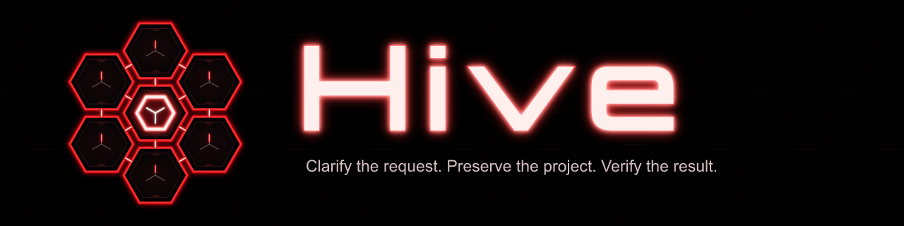
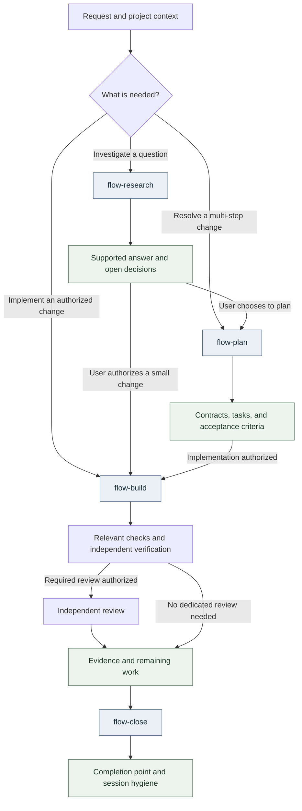

<div align="center">



<p><strong>Portable guidance for deliberate work with coding agents.</strong></p>
<p>Clarify the request. Preserve the project. Verify the result.</p>

<p>
<a href="https://hive.tricell.tech/">Docs</a> ·
<a href="#get-started">Get started</a> ·
<a href="#a-workflow-with-room-for-judgment">Workflow</a> ·
<a href="#hosts">Hosts</a> ·
<a href="#for-ai-agents">For AI agents</a> ·
<a href="#documentation">Documentation</a>
</p>

</div>

Hive brings shared working practices to **Claude Code, Codex, Grok Build, Pi,
OpenCode V2, and Cursor CLI**. It supplies guidance, activity skills, specialist
role definitions, and a manager that installs them in the host's native locations.
Each CLI keeps its own model loop, authentication, tools, permissions, and history.

Use it to investigate an uncertain request, plan a consequential change, or carry
an understood task through implementation and verification—with clear boundaries
between what was requested, what was authorized, and what was demonstrated.

> **Version 0.3.0 · unattended work when you say you are leaving**
> Each release sets [VERSION](VERSION) to its product version; between releases,
> `development` carries `dev`. Packages for macOS Apple
> Silicon and Linux arm64/amd64 are published on
> [GitHub Releases](https://github.com/JhonHawk/tricell-hive/releases). See the
> [changelog](CHANGELOG.md) for what this release contains.

## Why Hive

- **Start at the right depth.** A question can end with an answer. A small,
  understood change can go straight to implementation. Larger work gets explicit
  contracts, decisions, and acceptance criteria.
- **Make handoffs useful.** Specialist roles receive a bounded task, owned paths,
  relevant context, and evidence to return. Implementation, review, and
  verification have separate responsibilities.
- **Keep decisions connected to evidence.** Requirements and change records
  preserve context; findings distinguish observed results from assumptions and
  unfinished work.
- **Manage guidance without replacing the host.** Installation previews affected
  destinations, checks ownership and drift, preserves user content outside managed
  resources, and supports diagnosis and recovery.

## Get started

Install your coding CLI separately first; Hive neither installs CLI executables
nor authenticates providers. Close affected CLI sessions before installing and
start new ones afterward. The one-line installation is the recommended route;
the release package and the source checkout are alternatives.

### One-line installation (recommended)

On **macOS Apple Silicon** or **Linux (arm64/amd64)**, in a terminal:

```sh
curl -fsSL https://hive.tricell.tech/install.sh | sh
```

It asks which hosts to install and confirms before it writes.

- **Preview first:** append `-s -- --dry-run`. No host changes; the package is
  still downloaded.
- **Pick a release or hosts:** append `-s -- --version 0.3.0 --hosts claude,codex`.
- **Afterwards:** `hive` is not added to your `PATH`. It lives at
  `~/.local/share/hive/packages/hive-<version>-<os>-<arch>/bin/hive`.
- **Requirements:** `curl`, `tar`, and `shasum` or `sha256sum`.

The [installer contract](_support/docs/architecture/installer.md#one-line-installation)
lists what the script checks.

### From a release package

Packages are built for **macOS Apple Silicon (arm64)** and **Linux arm64 and
amd64**. macOS Intel is unsupported. To install by hand, download
`hive-<version>-<os>-<arch>.tar.gz` and its `.sha256` file from the
[GitHub Releases page](https://github.com/JhonHawk/tricell-hive/releases), then
verify, extract, preview, and install:

```sh
shasum -a 256 -c hive-<version>-<os>-<arch>.tar.gz.sha256   # or: sha256sum -c
tar -xzf hive-<version>-<os>-<arch>.tar.gz
cd hive-<version>-<os>-<arch>
./install.sh --dry-run
./install.sh
```

`install.sh` asks which hosts to install and confirms before it writes. It does
not put `hive` on your `PATH`: run later commands with the extracted `bin/hive`
(for example `./bin/hive status ...`), or copy that file to a directory on your
`PATH`.

On macOS, Gatekeeper may block a binary downloaded through a browser (a
possibility, not verified here). Either download with `curl` or `gh release
download`, or clear the quarantine flag on the extracted files:

```sh
xattr -dr com.apple.quarantine hive-<version>-<os>-<arch>
```

The core installs offline and needs no Go, Git, or GitHub CLI. The one network
step is optional: selecting the Pi host may run
`pi install npm:pi-subagents@0.74.0`, which downloads that package from npm.
GitHub's automatic **Source code** archives are not packages; use the
`hive-<version>-…` assets.

### From a source checkout

From the checkout root, with **Go 1.27.0 or later** as declared in [go.mod](go.mod):

```sh
# Preview the destinations, then install with terminal confirmation.
go run ./tooling/cli install --hosts codex --dry-run
go run ./tooling/cli install --hosts codex
```

Replace `codex` with your host, or a comma-separated selection such as
`codex,claude`. The installer shows destinations and private backup locations
before requiring affirmative confirmation. The first build needs access to the
Go modules unless they are already cached.

<details>
<summary><strong>Package building and optional capabilities</strong></summary>

Maintainers can build packages locally with `go run ./tooling/package --out ./dist`.
Building does not publish a release.

Engram and Context7 are optional, separately managed capabilities with official
manual instructions and no automated provider recipes or credential requests. The
one automated step is pi-subagents, which a user-scope Pi installation adds with
`pi install` when Pi does not already declare it. Selecting a manual capability leaves the installed
core intact but returns a non-zero exit status to signal unfinished setup.
`hive setup` reports local discovery without installing tools; discovery does not
establish authentication, service access, or host loading.

See the [installer contract](_support/docs/architecture/installer.md) for package
checks, legacy migration, and interrupted-install recovery, and
[optional tool dependencies](_support/docs/architecture/tool-dependencies.md)
for capability requirements.

</details>

## Hosts

Six host adapters are implemented. Their presence and installation on disk do
not prove that a particular session loaded the content or followed it.

| Host | Scope | Requirements and limits |
| --- | --- | --- |
| Claude Code | User and project | Native instructions, skills, and rendered roles. A project's `CLAUDE.md` must import `@AGENTS.md`. |
| Codex | User and project | Native instructions, shared skills, and rendered roles. |
| Grok Build | User | Claude instruction compatibility must be enabled, or the install reports a conflict. Role selection varies by version. |
| Pi | User | Delegated roles need pi-subagents (installed through npm as described above). Honors `PI_CODING_AGENT_DIR`. |
| OpenCode V2 | User | Needs your own model providers; the default role profiles assume GitHub Copilot and OpenCode Go models, so set others with `hive models set`. |
| Cursor CLI | User | Loads no global instruction file; each repository needs a pointer line (below). User-level role selection remains unverified. |

Only Claude Code and Codex support `--scope project`; the other four reject it.
Project scope writes inside one repository:

```sh
./bin/hive plan install --hosts codex,claude --scope project --root /absolute/project --out /absolute/plan.json
./bin/hive apply --plan /absolute/plan.json
```

**Shared resources.** Hosts that share one file, such as the skills under
`~/.agents/skills`, are registered as consumers of it. Updating shared bytes
requires selecting every registered consumer, so installing one host may require
selecting others. Removing one host keeps a shared file until its last consumer
is removed.

**Grok and Cursor together.** Grok loads Hive's guidance from
`~/.claude/CLAUDE.md` and again from `~/.cursor/AGENTS.md`, about 10,700 tokens
per session. The installer warns about it; setting `agents = false` under
`[compat.cursor]` in Grok's `config.toml` removes the copy, at the cost that your
own text in `~/.cursor/AGENTS.md` stops loading in Grok.

**Cursor pointer.** Cursor CLI does not read `~/.cursor/AGENTS.md` on its own. Add
this line to each repository's `AGENTS.md` where you use Cursor, near the top and
outside its `## Hive` section:

```markdown
Cursor sessions: unless your loaded instructions contain the line "# Tricell Hive guidance" as a heading of its own, read `~/.cursor/AGENTS.md` before any other action and follow it. If that file is missing, say so and continue.
```

See [native destinations](_support/docs/architecture/deployment-manager.md#content-and-native-destinations)
and [agent delivery](_support/docs/architecture/agent-delivery.md) for documented
versions and observations. [Role profiles](integrations/agent-profiles.json)
configure model and effort defaults; account access, effective child models,
native permissions, and parent overrides still need to be checked in context.
Hive supplies no model runtime or universal permission sandbox.

## Update, verify, recover, and uninstall

The commands below call `hive`. After a one-line installation it is
`~/.local/share/hive/packages/hive-<version>-<os>-<arch>/bin/hive`; after a
package installation, the extracted `bin/hive`; in a source checkout, use
`go run ./tooling/cli`. Copy or link it into a directory on your `PATH` to type
`hive` directly.

**Update.** One-line users run the same command again; each version adds its
own folder under `~/.local/share/hive/packages/`, and older ones can be deleted
once you no longer need them for recovery. Package users run the
newer package's `./install.sh`. Source users
pull, rebuild the binary when `tooling/` or `integrations/` changed, then preview
and apply. `hive update` deploys the committed `HEAD`, never uncommitted edits,
and does not replace the binary:

```sh
git pull
go build -o ~/bin/hive ./tooling/cli   # if tooling/ or integrations/ changed; use your hive path
hive update --dry-run
hive update
```

**Verify.** `status` checks managed files, `doctor` reports CLI and installation
diagnostics, and `models` reports effective role configuration. Installed files,
discovered roles, and a successful model task are different kinds of evidence.

```sh
hive status --hosts codex --scope user
hive doctor
hive models
```

**Recover.** An interrupted operation blocks further plans until recovery runs:

```sh
hive recover [--state-dir DIR]
```

**Uninstall.** Write a removal plan, review it, then apply it. Without `--out`,
`plan remove` only prints the plan:

```sh
hive plan remove --hosts <hosts> --scope user --out <plan.json>
hive apply --plan <plan.json>
```

Only the managed instruction block and files Hive created are removed; your
other content stays. In the full-screen interface (`hive`, or `hive tui`), `u` in
the CLIs view opens **Uninstall all**, which removes every registered host after a
confirmation that starts on Cancel. The
[manager contract](_support/docs/architecture/deployment-manager.md) documents
project scope, saved plans, removal, and recovery; the
[update reference](_support/docs/architecture/deployment-manager.md#update-from-a-commit-and-list-releases)
covers exact revision selection.

## A workflow with room for judgment

Start where the request belongs. These are available routes, not a mandatory
sequence for every task. Authorization and preservation apply throughout.



- [Research](https://hive.tricell.tech/flows/research/) ([skill](content/skills/flow-research/SKILL.md)) turns uncertainty into a supported
  answer. It can stand alone and does not authorize implementation.
- [Plan](https://hive.tricell.tech/flows/plan/) ([skill](content/skills/flow-plan/SKILL.md)) resolves consequential decisions and
  defines contracts, verifiable tasks, and acceptance criteria when needed.
- [Build](https://hive.tricell.tech/flows/build/) ([skill](content/skills/flow-build/SKILL.md)) reconciles current state, implements
  authorized work, and verifies affected behavior. Independent verification and
  dedicated review follow the applicable task and risk rules.
- [Close](https://hive.tricell.tech/flows/close/) ([skill](content/skills/flow-close/SKILL.md)) reconciles the completion record and
  cleans up task-owned temporary resources while preserving unfinished work.

The [shared guidance](content/guidance/global.md) owns the detailed authorization,
preservation, evidence, and artifact rules. Local edits, commits, publication,
merges, and deployments are distinct effects; a plan or skill selection does not
provide authorization for them.

## Work in your project

Keep project context and repository settings in `AGENTS.md`: project identity,
base branch, tracker, and the versioned requirements directory. Follow your CLI's
native instruction and skill discovery mechanism.
[Hive's repository guidance](AGENTS.md) is an example for this project, not a file
to copy unchanged into another one.

Give the agent an outcome and clear boundaries:

```text
Investigate why this endpoint times out. Read only; report evidence and options.
Plan the API change, including compatibility and acceptance checks.
Implement the agreed change locally and verify it. Do not commit or publish.
Close this work item and clean up only the temporary resources it created.
```

## For AI agents

Hive is a guidance layer plus a manager: shared rules, activity skills, and
specialist role definitions that the manager installs into each coding CLI's
native locations. The files an agent should read first are in
[llms.txt](llms.txt).

- `content/` is distributable: shared guidance, activity skills, canonical roles,
  and voices.
- `integrations/` is distributable: per-host destinations and role profiles.
- `tooling/` is the Go manager, distribution logic, and package builder.
- `_support/` is internal maintainer material: architecture docs, research, and
  change records under `_support/openspec/`. It is not installed.
- `tests/` holds content checks, fixtures, and evaluation tooling. It is not
  installed.
- `site/` is the source of the documentation site for people. It is
  not installed.
- The root [AGENTS.md](AGENTS.md) is maintainer guidance for this repository, not
  guidance to copy into another project.

## Documentation

- [Documentation site](https://hive.tricell.tech/) — one page per flow: when to
  use it, what it produces, and what it does not do.
- [Changelog](CHANGELOG.md), [contributing](CONTRIBUTING.md), and
  [security policy](SECURITY.md).
- [Architecture](_support/docs/architecture/repository-and-distribution.md) —
  structure, ownership, managed instruction blocks, and preservation.
- [Requirements and changes](_support/openspec/) — versioned requirements and
  retained change records.
- [Harness engineering research](_support/docs/harness-engineering/README.md) —
  research sources and the measurement standard.
- [content/](content/) — canonical guidance, skills, specialist roles, and voices.
- [integrations/](integrations/) — native host destinations and role profiles.
- [tooling/](tooling/) — Go manager, distribution logic, and package builder.
- [tests/](tests/) — content checks, fixtures, and evaluation tooling.

For manager development, run `go vet ./...` and `go test ./...`; concurrency
changes also require `go test -race ./...`. The
[verification contract](_support/docs/architecture/deployment-manager.md#verification)
explains additional checks and their limits. Model behavior pilots remain paused.
Ordinary source and installation tests do not establish model compliance or a
measured improvement in speed, quality, or reliability.

## History and provenance

The preserved history records delegation and separate verification in June 2026,
expanded external research in August, and dedicated research procedures, critical
synthesis, and specialist research roles in September. The
[history and technical provenance](_support/docs/history/history-and-provenance.md)
documents the five milestones, curated commit mappings, attribution, and the
limits of Git dates and external corroboration. These records describe Hive's
evolution; they do not establish invention, priority, or independence from other
projects. Historical implementations are context, not current installation instructions.
