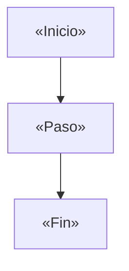
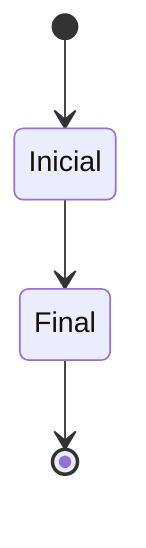

import { Aside, Steps } from "@astrojs/starlight/components";
import SpecRubric from "../../../components/SpecRubric.astro";

<SpecRubric {...frontmatter.workflow} />

<!--
  BRD — anatomía de referencia. Reference (dominante) + explanation, nunca how-to.
  Voz impersonal en 3ª persona. El cuerpo empieza en `##`. El import de SpecRubric
  asume la página en src/content/docs/«module»/«slice».mdx (3 niveles hasta
  src/components/). Reemplaza los «placeholders» y borra estos comentarios.
-->

<Aside type="note" title="Qué es y qué no es este documento">
  Este BRD define reglas de **negocio** verificables (el _qué_ y el _por qué_). El detalle técnico —contratos, endpoints, modelo de datos— es un artefacto separado.
</Aside>

## Propósito

«El porqué de la rebanada y su métrica de éxito (p. ej. "menos de 2 minutos").»

## Actores y precondiciones

«Quién participa y qué debe cumplirse antes de iniciar el flujo.»

## Flujo end-to-end

<Steps>

1. «Paso.»
2. «Paso.»

</Steps>

## Reglas de negocio

«Datos capturados y otras reglas. Declarativo, neutral, sin interpretación.»

## Estados y transiciones

{/* Nombres de estado de una palabra (mermaid stateDiagram no admite espacios);
    usa `state "Etiqueta con espacios" as Alias` si necesitas una etiqueta larga. */}

## Escenarios de aceptación

Numerados; camino feliz + todos los caminos negativos (input inválido,
expiración, límites, error de sistema).

### 1. «Camino feliz»

- **Dado** «precondición».
- **Cuando** «acción».
- **Entonces** «resultado observable».

## Decisiones pendientes del PO

«Las preguntas abiertas se documentan, no se ocultan.»

## Referencia visual

«Enlace al mock o prototipo navegable, si existe.»
